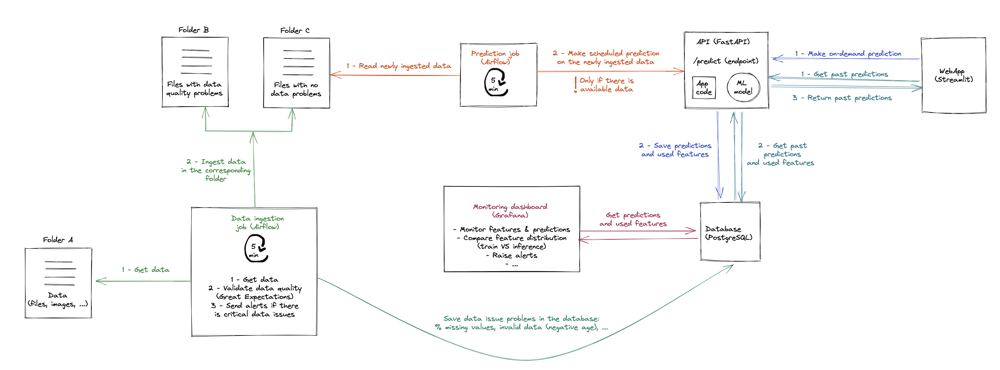

# dsp23-project
## For this assignment you need to submit a PDF document with:

**1. Your group name AND member list (the group specifications were defined in the class)**  
 1. Group Name: Data Transformer team
 2. Members:
	 - Mamadou Mouctar Baldé
	 - Thiago Amado Costa
	 - Laurids Radtke 

**2. A description of your project subject with the following information:**  
 	. The chosen use case: **House prices prediction** 
 	. The link and description of the dataset you'll be using for the use case. You should not submit the dataset itself but a link  
	 	- **Link of the train set:** https://drive.google.com/file/d/1xM52xXHPGeawkzqQS8sJOHQGa-xqHkaH/view?usp=sharing  
	 	- **Link of the test set:** https://drive.google.com/file/d/1UmwFn74BPTCPG6xhYzSIPdmnTZENzzHY/view?usp=sharing  
	 	- **Description:**  
			1. MSSubClass: Identifies the type of dwel  
			2. MSZoning: Identifies the general zoning classification of the sale.  
			3. LotFrontage: Linear feet of street connected to property  
			4. LotArea: Lot size in square feet  
			5. Street: Type of road access to property  
  			6. Alley: Type of alley access to property  		
			7. LotShape: General shape of property     
			8. LandContour: Flatness of the property  
			9. Utilities: Type of utilities available  
			10. LotConfig: Lot configuration  
			11. LandSlope: Slope of property  
			12. Neighborhood: Physical locations within Ames city limits  
			13. Condition1: Proximity to various conditions  
			14. Condition2: Proximity to various conditions (if more than one is present)  
			15. BldgType: Type of dwelling  
			16. HouseStyle: Style of dwelling  
			17. OverallQual: Rates the overall material and finish of the house  
			18. OverallCond: Rates the overall condition of the house  
			19. YearBuilt: Original construction date  
			20. YearRemodAdd: Remodel date (same as construction date if no remodeling or additions)  
			21. RoofStyle: Type of roof  
			22. RoofMatl: Roof material  
			23. Exterior1st: Exterior covering on house  
			24. Exterior2nd: Exterior covering on house (if more than one material)  
			25. MasVnrType: Masonry veneer type  
			26. MasVnrArea: Masonry veneer area in square feet  
			27. ExterQual: Evaluates the quality of the material on the exterior   
			28. ExterCond: Evaluates the present condition of the material on the exterior  
			29. Foundation: Type of foundation  
			30. BsmtQual: Evaluates the height of the basement  
			31. BsmtCond: Evaluates the general condition of the basement  
			32. BsmtExposure: Refers to walkout or garden level walls  
			33. BsmtFinType1: Rating of basement finished area  
			34. BsmtFinSF1: Type 1 finished square feet  
			35. BsmtFinType2: Rating of basement finished area (if multiple types)  
			36. BsmtFinSF2: Type 2 finished square feet  
			37. BsmtUnfSF: Unfinished square feet of basement area  
			38. TotalBsmtSF: Total square feet of basement area  
			39. Heating: Type of heating  
			40. HeatingQC: Heating quality and condition  
			41. CentralAir: Central air conditioning  
			42. Electrical: Electrical system  
			43. 1stFlrSF: First Floor square feet  
			44. 2ndFlrSF: Second floor square feet  
			45. LowQualFinSF: Low quality finished square feet (all floors)  
			46. GrLivArea: Above grade (ground) living area square feet  
			47. BsmtFullBath: Basement full bathrooms  
			48. BsmtHalfBath: Basement half bathrooms  
			49. FullBath: Full bathrooms above grade  
			50. HalfBath: Half baths above grade  
			51. Bedroom: Bedrooms above grade (does NOT include basement bedrooms)  
			52. Kitchen: Kitchens above grade  
			53. KitchenQual: Kitchen quality  
			54. TotRmsAbvGrd: Total rooms above grade (does not include bathrooms)  
			55. Functional: Home functionality (Assume typical unless deductions are warranted)  
			56. Fireplaces: Number of fireplaces  
			57. FireplaceQu: Fireplace quality  
			58. GarageType: Garage location  
			59. GarageYrBlt: Year garage was built  
			60. GarageFinish: Interior finish of the garage  
			61. GarageCars: Size of garage in car capacity  
			62. GarageArea: Size of garage in square feet  
			63. GarageQual: Garage quality  
			64. GarageCond: Garage condition  
			65. PavedDrive: Paved driveway  
			66. WoodDeckSF: Wood deck area in square feet  
			67. OpenPorchSF: Open porch area in square feet  
			68. EnclosedPorch: Enclosed porch area in square feet  
			69. 3SsnPorch: Three season porch area in square feet  
			70. ScreenPorch: Screen porch area in square feet  
			71. PoolArea: Pool area in square feet  
			72. PoolQC: Pool quality  
			73. Fence: Fence quality  
			74. MiscFeature: Miscellaneous feature not covered in other categories  
			75. MiscVal: Value of miscellaneous feature  
			76. MoSold: Month Sold (MM)  
			77. YrSold: Year Sold (YYYY)  
			78. SaleType: Type of sale  
			79. SaleCondition: Condition of sale  

 **3. An architecture diagram (what we already did in the class but you need to choose the technologies for each component: eg: FastAPI for
     the model serving and streamlit for the webapp**

